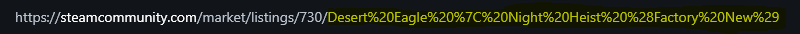
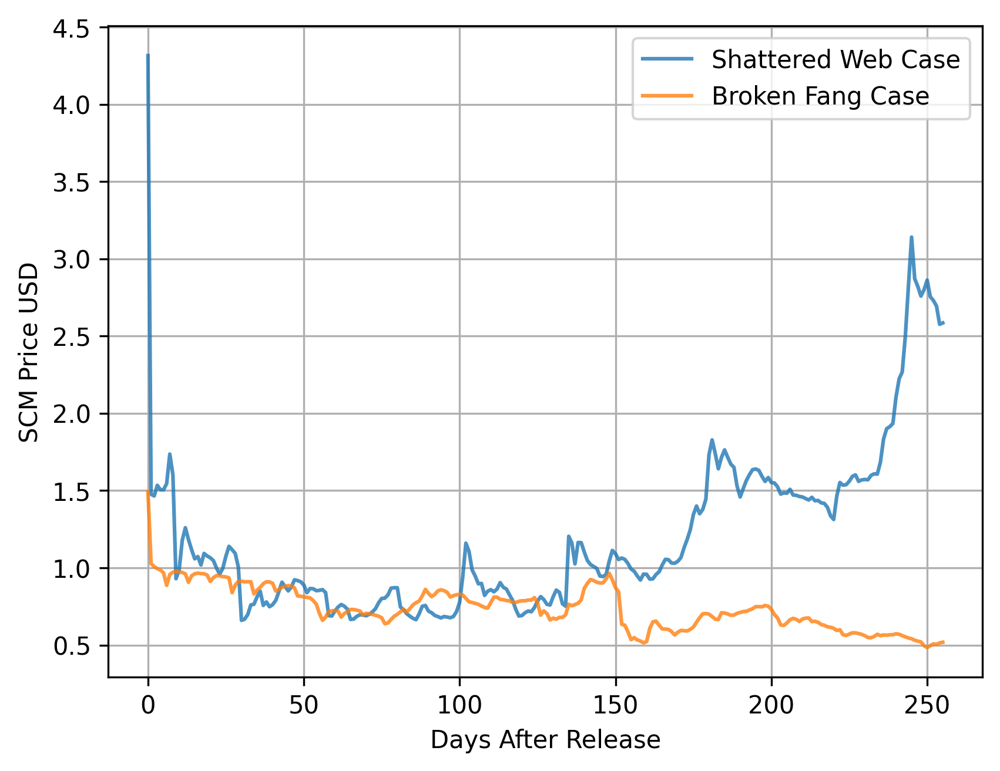
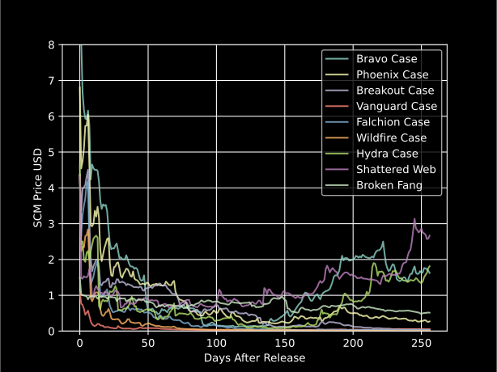

# SCM-Graph-Maker
## Compare Price History of multiple items from the steam community market. By plotting them on the same graph

#### 1. Create a `Cookies.env` file in the same directory as the program and open it up with your text editor
#### 2. Login to Steam on a browser and access the cookies on the page and paste the ones *metioned below* in the same format

```env
steamLogin =
sessionid =
steamparental =
steamRememberLogin =
steamMachineAuthsteamID64 =
```

#### 3. Change the SKINS dictionary depending on the skins you want to compare. 

```python
skins = { 
          'skin1 name' : 'market_hash',
          'skin2 name' : 'market_hash'
        }
```
#### \*To find the 'market hash' go to the item's SCM page and copy the last string in the url (highlighted below)

##### __\*You can add as many as you want but beware of the graph getting messy__

#### Some Example Comparisons



