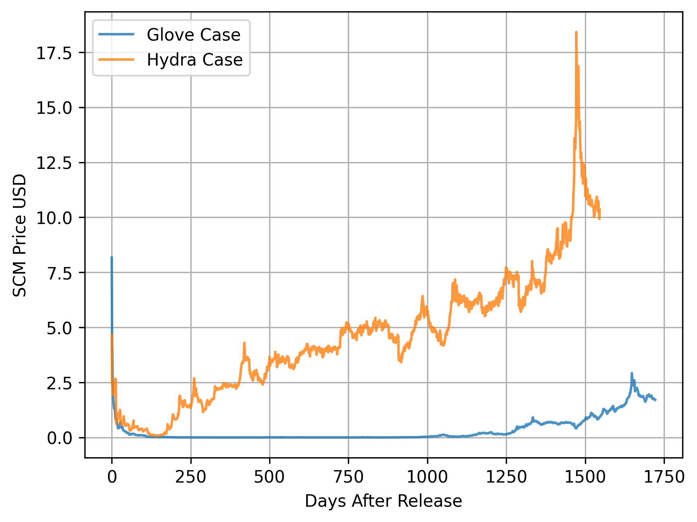

# SCM-Graph-Maker
## Compare Price History of multiple items from the steam community market. By plotting them on the same graph

#### 1. Create a `Cookies.env` file in the same directory as the program and open it up with your text editor
#### 2. Login to Steam on a browser and access the cookies on the page and copy paste them in the below order

```env
steamLogin =
sessionid =
steamparental =
steamRememberLogin =
steamMachineAuth76561198416733081 =
```

#### 3. Change the SKINS dictionary depending on the number of / skin you want to compare.

```python
skins = { 
          'skin1 name' : 'skin1 market hash',
          'skin2 name' : 'skin2 market hash'
        }
```
##### *To find the 'market hash' go to the item's SCM page and copy the last String in the url

Some Example Comparisons



